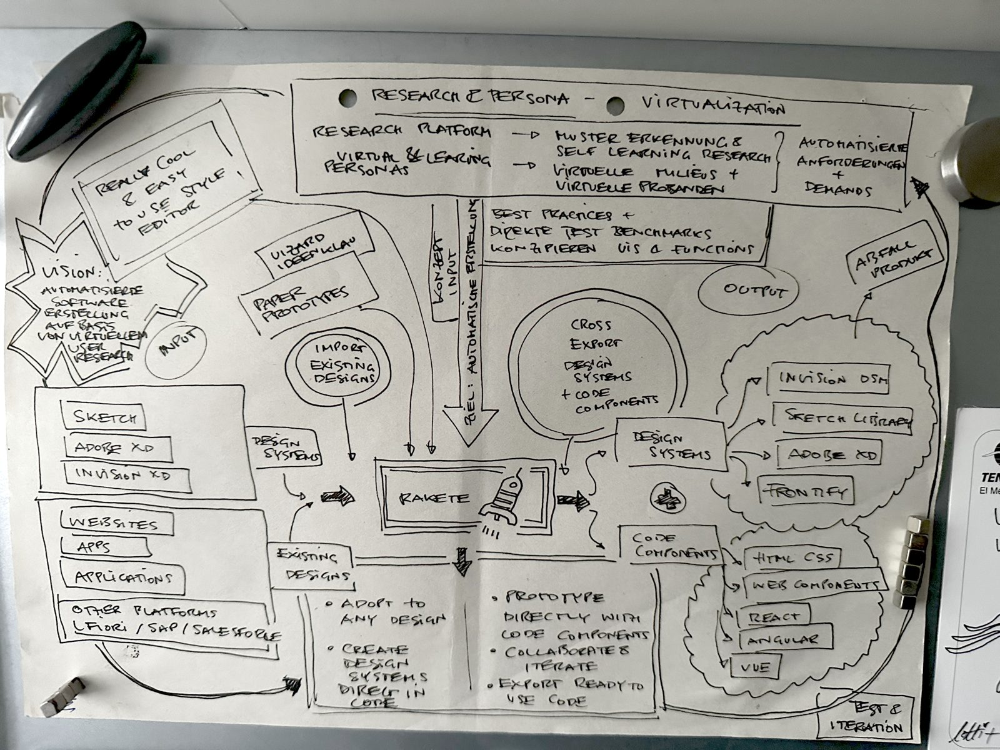

# Vizio – Brands become software

*Why Fundamento starts with a data model, conjunction sets and rulings instead of a component library.*

## Origin: a sketch from 2017

The idea is older than the tools that can build it. In 2017 the founder of Fundamento drew it on one sheet of paper: existing designs, websites, apps and enterprise platforms flow in; a style editor and an import step shape them; a single engine in the middle (the "Rakete", the rocket) turns them into design systems and code components for every target; test and iteration feed back into research. The vision in the corner reads: *automated software creation based on virtual user research.*

Almost every box on that sheet now has a name in Fundamento: the engine is the **Modelo**, the import is the **Enportilo**, the style editor the **Agordilo**, the cross export the **Projekcioj**, "adopt to any design" the **Aspekto** and the fluid brand, test and iteration the **Regularo** in which every finding becomes a rule. Virtual user research is being built as a separate module next to Fundamento.

Most of the tools named on the sketch have since disappeared or stalled. The architecture did not. That is the strongest argument for starting with a model: tools are projections, and projections can be replaced.

## 2022: eight theses and a vision

In May 2022 the same founder gave a talk called *The Future of Design – as Thorsten sees it (highly subjective)*. Its argument: every team uses the same tools, shares the same ideas, builds the same components, applies similar semantics and technologies on similar architectures – and still implements design by hand. Multiply those nine shared things by six forces from outside (AI, low code, standard platforms, automated pipelines, libraries, code first) and the result is **design automation**.

The eight theses, as stated then:

1. UI design and frontend development will be standardized above technical touchpoints and tools.
2. Every possible interaction will be developed; additional ones will no longer be accepted by users or funded by companies.
3. Handcrafted digital designs will become luxury goods, like haute couture.
4. The worlds will converge through the integration of services between homegrown, low-code and standard platforms.
5. Designers will need even more technical expertise.
6. Microservices and microfrontends will prevail.
7. Monolithic standard platforms become adaptable and invisible through design token pipelines.
8. Everything that can be automated will be automated – including design.

And the vision: AI-driven crawlers identify design tokens from public brand websites; design systems are created with configurators in a few steps, and by machines; designs are implemented through token APIs and pipelines; applications become throwaway goods; designers spend most of their time on users and processes, not pixels.

Four years later most of this is observable. Tokens are extracted from websites by tools, the token format is a stable standard, agents read design systems through MCP, interfaces are generated per request. One prediction took a different path: it was not low-code platforms that took over implementation, but AI agents writing code. The direction held; the vehicle changed. Fundamento is the attempt to build the rest of that vision in the open: the importer, the configurator, the token pipeline, and the brand that follows its context – thesis 6 and 7 turned into a model.

## The question changed

The first question was an operational one: how do we bring a new brand into a multi-brand design system without rebuilding it by hand? Shared core plus brand themes answered part of it. Colors, type, spacing, radius and motion became parameters of one system.

The question today is larger: **how must a brand be described so that people and AI systems can understand it, apply it, check it and run it consistently across any touchpoint, including ones nobody designed in advance?**

Interfaces are starting to be generated from intent, context, data and rules. A screen may not exist until a user asks for it. Brand guidelines as a PDF cannot govern that. A classic design system, written for humans, cannot either. What is needed is a brand that is **specified, versioned and executable**.

> The future of branding is not generating more brand assets. It is making the brand itself executable.

## From identity to specification

A brand is more than a visual skin. It has layers: purpose and positioning, personality, visual identity, experience (layout, density, motion, interaction), communication (voice, vocabulary), and behavior: how it adapts to situations and what it may and may not do. Each layer can be described as data plus rules with reasons.

| Classic chain | Executable chain |
|---|---|
| Strategy → identity → guidelines PDF → design system → templates → products | Strategy → brand specification → machine-readable model → runtime → generated experiences |

In the executable chain, the brand is not documented after the fact. It is the source, and everything else is derived from it and checked against it.

## How Fundamento implements this

| Idea | Fundamento today |
|---|---|
| Machine-readable brand model | **Modelo**: one canonical data model; tokens in W3C DTCG only |
| A brand as a package | **Aspekto**: a complete assignment of the Vortaro, shipped as its own package with its own license; the visual layer (`vida`) is the first of several **Tavoloj** |
| Adaptation to situations | **Dimensioj**: color scheme, contrast, density, viewport, motion, and further dimensions through data alone |
| Rules with reasons | **Regularo**: every rule carries its **kialo**; decisions are kept as **Jugxoj** (precedents) |
| Brand runtime | **MCP server**: any agent asks what exists, what a value is in a given situation, why, and whether a choice conforms |
| Versioning and CI/CD for brands | stable IDs, deterministic byte-identical exports, conformance checks on every change |
| Brand interpretation | the first derived brand in Fundamento was built by documented rules from a public website, each step recorded, each finding turned into a rule |

## Principles we hold

1. **Specification over assets.** A file that cannot be checked is not a brand, it is a picture of one.
2. **Rules carry reasons.** A constraint without a kialo is invalid. Agents cite reasons, not taste.
3. **Findings become rules.** Every problem a human reviewer finds that no check found becomes a rule with a reason, and where it can be measured, an automatic check.
4. **Thresholds are never lowered.** A brand adapts to accessibility, not the other way round.
5. **Clean room.** Other systems are benchmarks for requirements, never sources of content.
6. **Agents first, humans always.** The model is built for machines to read; people decide meaning, positioning, taste and direction.

## Humans and machines

The aim is not that AI replaces brand designers. The model is **human direction, machine exploration, machine execution, human judgment**. People decide meaning, cultural relevance, differentiation and taste. Machines research, explore variants, check consistency, document, transform and implement. Brand design moves from asset creation to **system direction**.

## Fluid brands: the brand follows the context

A multi-brand system usually means many brands living side by side, each in its own product. The harder and more valuable case is different: **the brand follows the context, not the provider.**

In brand groups with a hundred brands and more, this has been the goal for years, and it is the problem the founder of Fundamento worked on in his previous design-system role. A viewer pauses a film in the entertainment service and buys the sweater the lead actor wears; the purchase runs through the fashion service, but it looks like the entertainment service. A visitor buys a ticket in the portal of a heritage site and pays with the group's payment service; the payment looks like the heritage site, not like the payment brand.

Fundamento calls this a **fluid brand**. Components are brand-agnostic: they know the vocabulary, never a brand. The system is multi-brand: many brands, each complete, none a skin over another. The runtime is context-adaptive: which brand governs which roles is decided by the situation, through a precedence rule that is data, carries a reason and can be queried.

Three cases follow from it:

- **Family:** sub-brands are derived from a parent brand by documented rules and shipped as complete brands, so a change to the parent regenerates every child.
- **Host wins:** an embedded service takes the brand of the place it appears in. The shared vocabulary is the contract; the brand is only the assignment of values.
- **Guest wins, in permitted roles:** a sponsor's brand is laid over the host for a time and a place, with consent, and withdrawn afterwards.

One limit holds in every case: **trust and safety do not flow.** Payment confirmations, security marks, the name of the payment provider, warnings and safety-relevant information never take another brand's values. If a payment form can wear any brand, a user can no longer tell a real payment from a fake one.

## Where this leads

The design system is not the end product. It is the first executable projection of a brand specification. Next come context-dependent behavior at runtime (a brand that is calm in the morning and warm in the evening, within its rules), a formal ontology so every export is also a knowledge graph, and tooling that creates new brands through an iterative, rule-bound process in which every iteration is a valid, complete brand rather than a mood board. Brands will be described in words and rules, steered by examples and generated; configured step by step, or imported from examples and links for a client's commission, applied in that client's context rather than copied.

In one sentence: **brands become software.**
